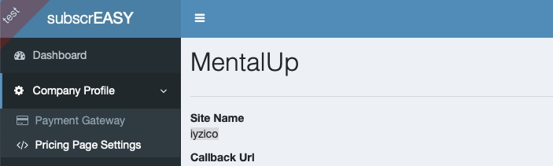
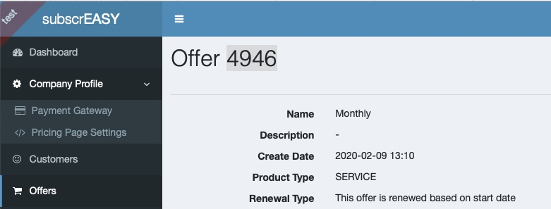

### Download dependencies

```
npm install
```

### Run the application

```
npm run
```

### Configuration

Replace following parameters with yours in `index.html`.

```
let companySiteName = "iyzico"
let offerId = "4946";
```

You can find your `companySiteName` in "Company Profile" / "Pricing Page Settings"



You can find your `offerId` in "Offers" page. If there is no offer listed, you need to create at least 1 offer first.




